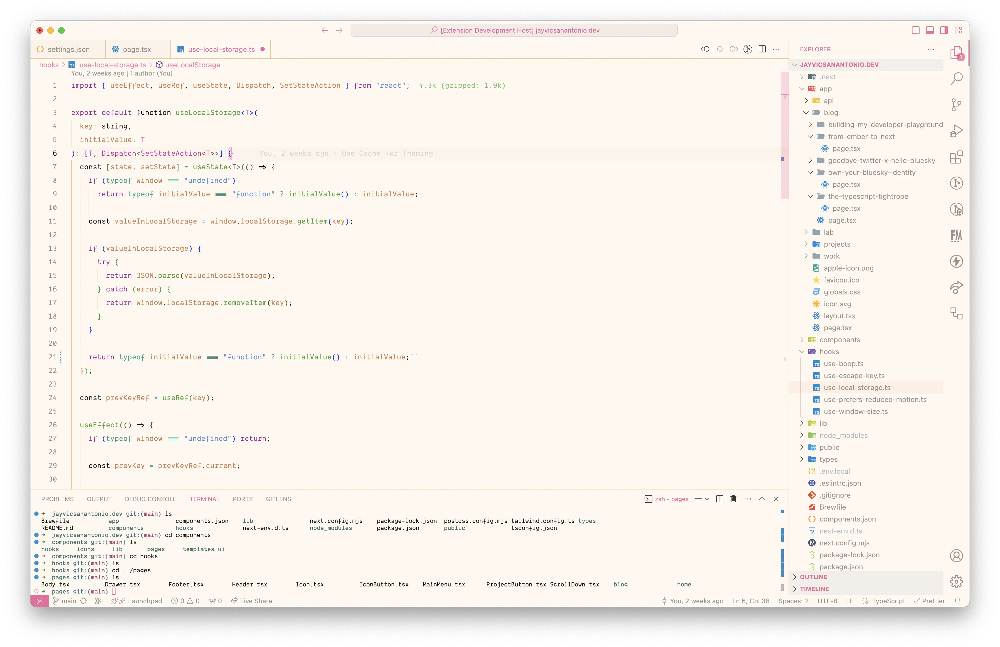
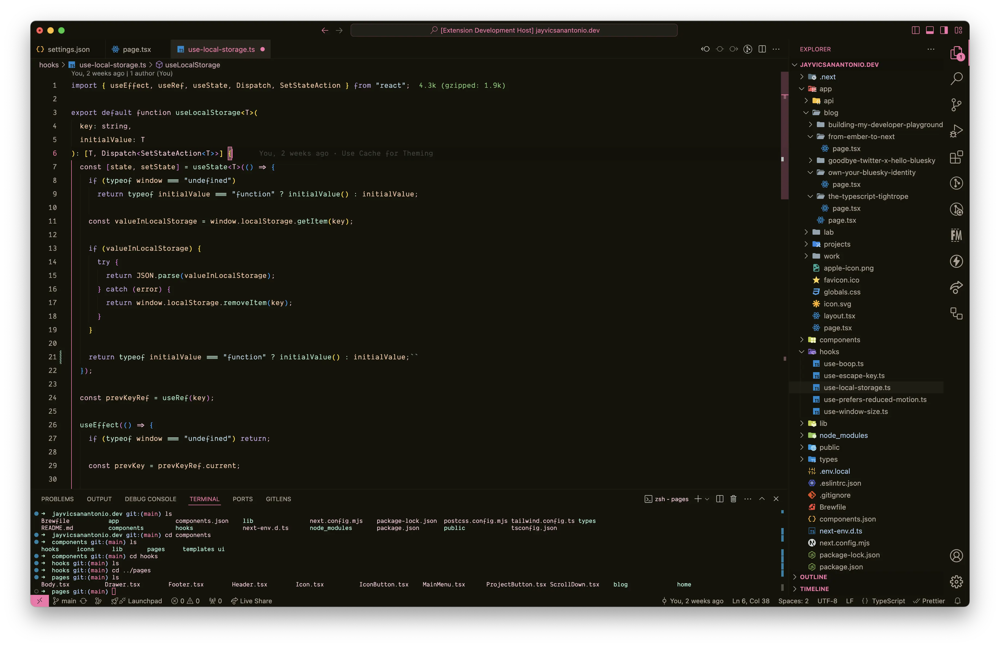
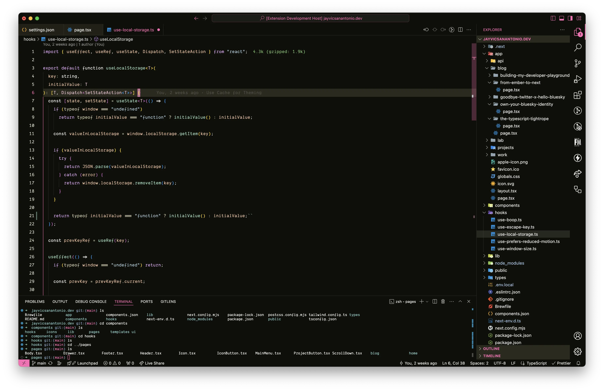

# Barbenheimer VS Code Theme

This VS Code theme draws inspiration from the cultural phenomenon "Barbenheimer," which arose from the coinciding release dates of Greta Gerwig's Barbie and Christopher Nolan's Oppenheimer. It playfully blends the vibrant and colorful world of Barbie with the stark and intense imagery of Oppenheimer, resulting in a unique coding experience.

The theme offers three distinct variants, each capturing a different facet of the Barbenheimer concept. Whether you prefer the bright cheerfulness of Barbie's world or the somber atmosphere of Oppenheimer's, there's a style to fit your coding mood and personalize your VS Code environment.

## Installation

To install Barbenheimer, follow these steps:

- Open VS Code
- Go to **Extensions** (Ctrl+Shift+X)
- Search for Barbenheimer
- Click **Install**
- Click **Reload**
- Go to Code > Settings > Theme > Color Theme
- Select **Barbenheimer Dreamhouse**, **Barbenheimer Bunker** or **Barbenheimer Nuclear Sunrise**

## Variants

- **Barbenheimer Dreamhouse:** Embrace the vibrant and playful aesthetic of Barbie's world with this light theme. Soft pinks and contrasting darks are complemented by subtle, grounding tones inspired by Oppenheimer's world, resulting in a fun yet focused coding experience.

  **Color Palette:**

  | Color       | Hex Code | Role              |
  | ----------- | -------- | ----------------- |
  | Light Pink  | #F672AC  | Accent, Focus     |
  | Soft Pink   | #F4C2D9  | Text, Main        |
  | Off-White   | #FFF8F0  | Background        |
  | Light Brown | #F9C898  | Borders, Dividers |
  | Dark Brown  | #27241A  | UI Elements       |
  | Deep Purple | #7E57C2  | Subtle Highlight  |

  

- **Barbenheimer Bunker:** Delve into the serious and dramatic atmosphere of Oppenheimer's work with this dark theme. Muted hues and subtle highlights evoke a sophisticated environment for your code. Touches of pink add an unexpected warmth, reflecting the interconnectedness of the Barbenheimer concept.

  **Color Palette:**

  | Color       | Hex Code | Role              |
  | ----------- | -------- | ----------------- |
  | Deep Pink   | #E44288  | Accent, Focus     |
  | Muted Pink  | #F2A0C0  | Highlights        |
  | Dark Gray   | #14140B  | Background        |
  | Light Gray  | #4A4A40  | Borders, Dividers |
  | Off-Black   | #111109  | UI Elements       |
  | Deep Purple | #7E57C2  | Subtle Highlight  |

  

- **Barbenheimer Nuclear Sunrise:** Experience the stark contrast and intensity of the Barbenheimer duality with this high-contrast theme. Bold colors and sharp distinctions maximize readability and highlight key elements, drawing inspiration from both the vibrant hues of Barbie and the dramatic contrasts of Oppenheimer's story.

  **Color Palette:**

  | Color        | Hex Code | Role              |
  | ------------ | -------- | ----------------- |
  | Hot Pink     | #FF69B4  | Accent, Focus     |
  | White        | #FFFFFF  | Text, Main        |
  | Dark Gray    | #0F0F0A  | Background        |
  | Medium Gray  | #4A4A40  | Borders, Dividers |
  | Lighter Gray | #35352A  | UI Elements       |
  | Deep Purple  | #7E57C2  | Subtle Highlight  |

  

## Fonts

I am using a paid font titled [Dank Mono](https://dank.sh/). [Fira Code](https://github.com/tonsky/FiraCode) is a free one that works well too.

## Feedback

If you have any feedback or suggestions, please [open an issue](https://github.com/jpsanantonio/barbenheimer-vscode-theme/issues) or better yet, a [pull request](https://github.com/jpsanantonio/barbenheimer-vscode-theme/pulls). I would love to hear from you!

## License

Barbenheimer is licensed under the MIT License. See [LICENSE](LICENSE.md) for more details.
