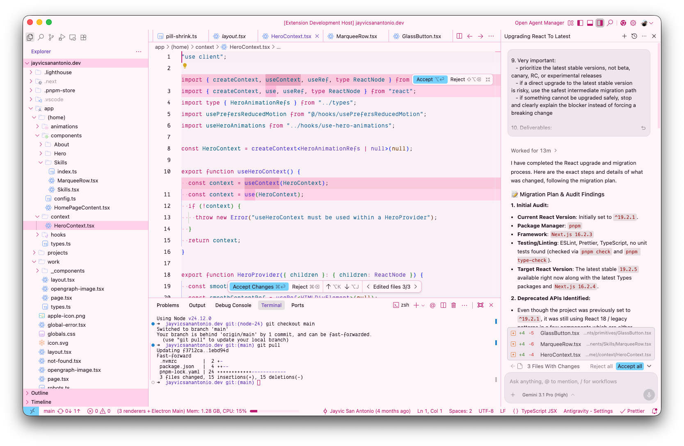
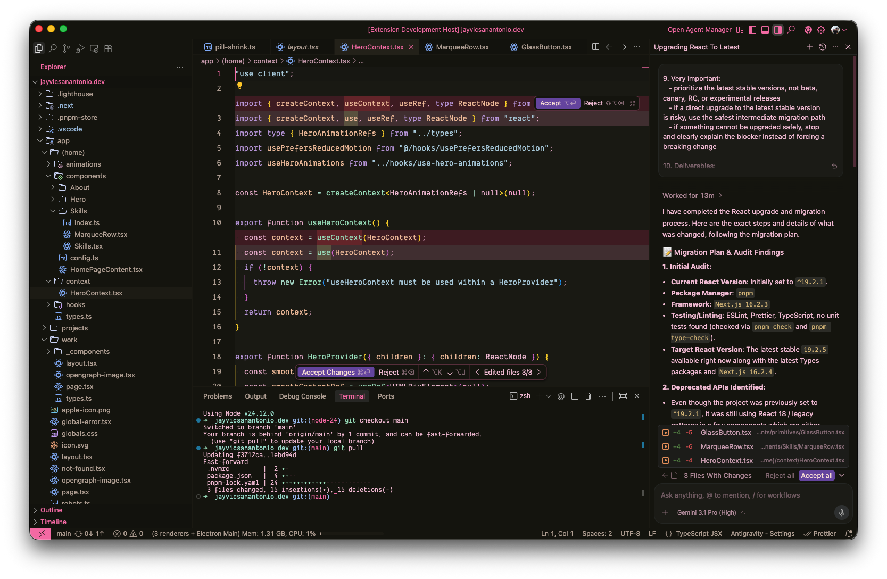
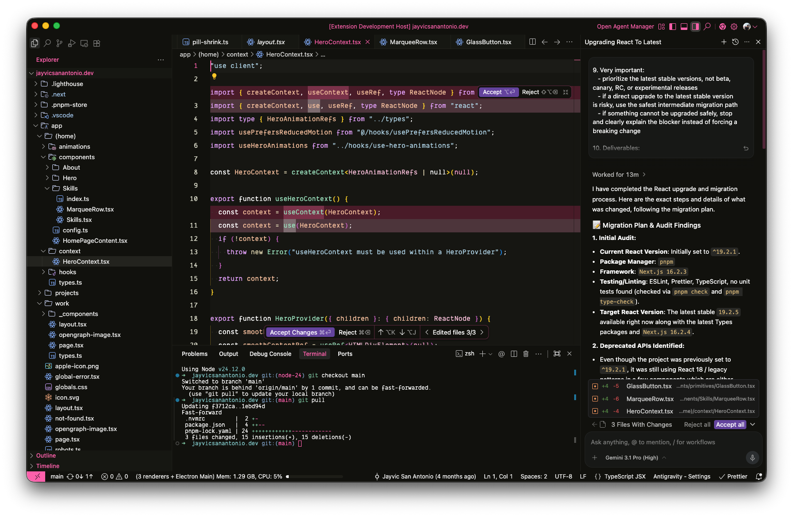

# Barbenheimer VS Code Theme

Barbenheimer is a VS Code theme suite inspired by the contrast between Barbie's playful color world and Oppenheimer's stark cinematic intensity. It includes one bright light theme and two dark themes, each tuned for readable editor text, clear buttons and badges, focused UI states, and expressive syntax color.

## Installation

- Open VS Code.
- Go to **Extensions**.
- Search for **Barbenheimer**.
- Click **Install**.
- Open **Preferences: Color Theme** from the Command Palette.
- Select **Barbenheimer Dreamhouse**, **Barbenheimer Bunker**, or **Barbenheimer Nuclear Sunrise**.

## Variants

### Barbenheimer Dreamhouse

Dreamhouse is the bright, girly, Barbie-forward variant. It uses a blush pink editor surface, saturated pink icons, sky-blue buttons and badges, purple links and syntax accents, and dark plum text for strong contrast.

**Current palette**

| Color            | Hex Code  | Role                                              |
| ---------------- | --------- | ------------------------------------------------- |
| Blush Background | `#FFF7FB` | Editor, sidebar, panels, title bar                |
| Dark Plum        | `#2A1726` | Main text, button text, badge text                |
| Barbie Pink      | `#C2187A` | Icons, cursor, activity bar, status/title accents |
| Light Pink       | `#F672AC` | Focus rings, progress, match highlights           |
| Soft Pink        | `#FFEAF5` | Hover surfaces and soft fills                     |
| Selection Pink   | `#FFD6EC` | Selected rows, section headers, editor selection  |
| Sky Blue         | `#80D8FF` | Buttons, extension buttons, numeric badges        |
| Sky Blue Hover   | `#5ABFEF` | Button hover states                               |
| Deep Purple      | `#7E57C2` | Links, tabs, types, functions, syntax accents     |
| Pink Border      | `#F3B5D6` | Borders, dividers, guides                         |



### Barbenheimer Bunker

Bunker is the moody dark theme. It keeps the Oppenheimer side grounded with black-olive backgrounds, restrained borders, pink active states, and purple primary buttons.

**Current palette**

| Color              | Hex Code    | Role                                       |
| ------------------ | ----------- | ------------------------------------------ |
| Bunker Background  | `#14140B`   | Editor, sidebar, panels, title bar         |
| Near-Black Surface | `#111109`   | Tabs, peek views, section headers          |
| Muted Border       | `#27241A66` | Structural dividers                        |
| Barbie Pink        | `#F672AC`   | Accents, active tabs, activity bar, badges |
| Soft Text Pink     | `#F4C2D9`   | General foreground                         |
| Warm Text Pink     | `#E9B2CF`   | Editor and widget text                     |
| Deep Purple        | `#7E57C2`   | Primary button background                  |
| Cream Text         | `#FCE5D8`   | Button text and hover foreground           |



### Barbenheimer Nuclear Sunrise

Nuclear Sunrise is the highest-contrast dark theme. It uses near-black backgrounds, white editor text, hot pink accents, a clear dark surface ladder, and purple primary buttons.

**Current palette**

| Color              | Hex Code    | Role                                         |
| ------------------ | ----------- | -------------------------------------------- |
| Nuclear Background | `#0F0F0A`   | Editor, sidebar, panels, title bar           |
| Subtle Surface     | `#171710`   | Current line, inactive tabs, section headers |
| Hover Surface      | `#202018`   | Hover states                                 |
| Selected Surface   | `#272720`   | Selection and focused rows                   |
| Raised Surface     | `#2A2A1F`   | Peek views and secondary controls            |
| Soft Border        | `#4A4A4044` | Structural dividers                          |
| Hot Pink           | `#FF69B4`   | Accents, activity bar, badges                |
| White              | `#FFFFFF`   | Main text and button text                    |
| Deep Purple        | `#7E57C2`   | Primary button background                    |



## Accessibility And Contrast

The current themes are tuned around readable UI surfaces and syntax tokens:

- Dreamhouse uses dark plum text on blush surfaces and sky-blue controls with dark text for high-contrast buttons and badges.
- Bunker and Nuclear Sunrise use light text on dark surfaces, with pink active states and softened structural borders.
- Numeric badges, primary buttons, extension buttons, activity icons, editor icons, and TS/TSX token colors have been checked for contrast in the current palettes.

Visual assets and screenshots may lag behind theme JSON changes. Relaunch the Extension Development Host and capture new previews after major color updates.

## Development

Install dependencies:

```sh
npm install
```

Launch the extension in VS Code:

```sh
code --extensionDevelopmentPath=$(pwd)
```

Package locally:

```sh
npx vsce package
```

Before publishing, test all three themes in the Extension Development Host and inspect representative files such as TypeScript, TSX, Markdown, JSON, and terminal output.

## Recommended Verification

- Cycle through all three variants in **Preferences: Color Theme**.
- Open a TSX file and confirm Dreamhouse token separation across imports, JSX tags, attributes, functions, constants, variables, and punctuation.
- Confirm Activity Bar and editor icons are pink in Dreamhouse where VS Code color tokens control them.
- Confirm numeric badges and buttons are sky blue in Dreamhouse.
- Confirm Bunker and Nuclear Sunrise buttons remain readable.
- Run JSON validation or parse all theme files before committing.

## Fonts

The screenshots use [Dank Mono](https://dank.sh/). [Fira Code](https://github.com/tonsky/FiraCode) is a free alternative that works well with the theme.

## Feedback

Open an issue or pull request at [jayvicsanantonio/barbenheimer-vscode-theme](https://github.com/jayvicsanantonio/barbenheimer-vscode-theme) with contrast notes, token-scope feedback, or preview screenshots.

## License

Barbenheimer is licensed under the MIT License. See [LICENSE](LICENSE.md) for details.
